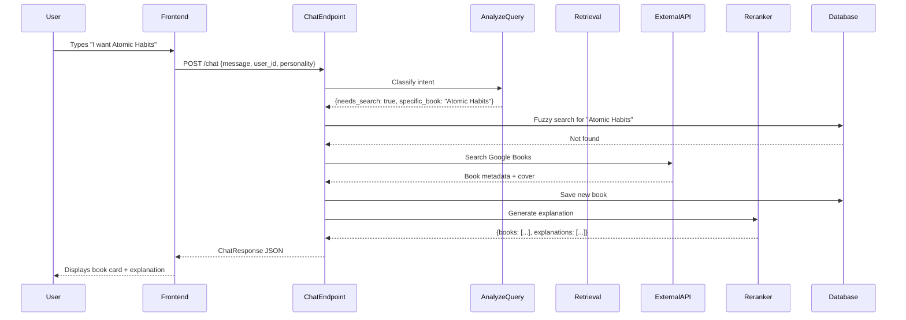
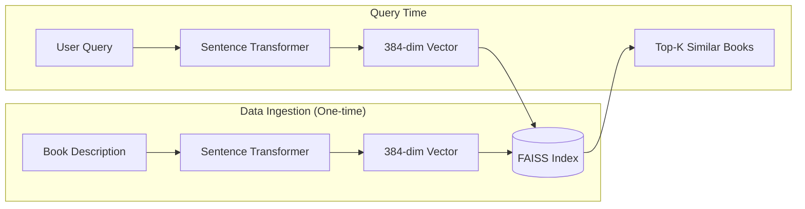

# BookAI Recommendation System
## Complete Technical Documentation & Design Rationale

---

# Table of Contents
1. [Executive Summary](#1-executive-summary)
2. [Terminology Glossary](#2-terminology-glossary)
3. [System Architecture](#3-system-architecture)
4. [The 4-Layer Cognitive Architecture](#4-the-4-layer-cognitive-architecture)
5. [Data Flow & Sequence Diagrams](#5-data-flow--sequence-diagrams)
6. [Database Design](#6-database-design)
7. [File Structure & Responsibilities](#7-file-structure--responsibilities)
8. [Technology Stack & Justifications](#8-technology-stack--justifications)
9. [Problems Encountered & Solutions](#9-problems-encountered--solutions)
10. [Frontend Design Philosophy](#10-frontend-design-philosophy)
11. [API Reference](#11-api-reference)
12. [Future Roadmap](#12-future-roadmap)

---

# 1. Executive Summary

**BookAI** is an intelligent, conversational book recommendation system that goes beyond simple keyword search. It combines:

- **Semantic Understanding**: Uses AI embeddings to understand the *meaning* of your request, not just the words.
- **Conversational Personality**: Chat with a librarian persona that adapts to your mood.
- **Hybrid Search**: Falls back gracefully across multiple data sources to always find something.
- **Real-time Learning**: Discovers books you ask about that aren't in the database yet.

### Why This Matters
Traditional book searches fail when:
- You don't know the exact title ("that book about habits")
- You want recommendations based on mood ("something uplifting")
- The book isn't in the local catalog

BookAI solves all three by combining vector similarity search with external API fallbacks and a conversational AI layer.

---

# 2. Terminology Glossary

Understanding these terms is essential to grasp the system:

### AI/ML Terms

| Term | Definition | Example in BookAI |
|------|------------|-------------------|
| **Embedding** | A numerical representation (vector) of text that captures its meaning. Similar meanings = similar vectors. | "I want a scary book" → `[0.23, -0.45, 0.12, ...]` (384 numbers) |
| **Vector Search** | Finding items by comparing how "close" their embeddings are in mathematical space. | Query embedding compared against all book embeddings |
| **FAISS** | Facebook AI Similarity Search. A library that makes searching millions of vectors blazingly fast. | Our in-memory index of 50,000 book embeddings |
| **Sentence Transformers** | A library that converts sentences into embeddings. We use `all-MiniLM-L6-v2`. | Converts user query and book descriptions to vectors |
| **LLM (Large Language Model)** | AI models trained on massive text data that can generate human-like responses. | Google Gemini generates the librarian's responses |
| **RAG (Retrieval-Augmented Generation)** | A pattern where we first RETRIEVE relevant data, then AUGMENT the LLM prompt with it, so it only talks about real data. | We retrieve books from DB, then ask Gemini to explain them |
| **Hallucination** | When an LLM invents information that doesn't exist. | Without RAG, Gemini might invent book titles |
| **JIT (Just-In-Time)** | Fetching or computing data only when needed, not preemptively. | If user asks for "Atomic Habits" and it's not in DB, we fetch it from Google Books API right then |

### Backend Terms

| Term | Definition | Example in BookAI |
|------|------------|-------------------|
| **FastAPI** | A modern Python web framework for building APIs. Fast, async, auto-generates docs. | Our entire backend is built on FastAPI |
| **Pydantic** | A library for data validation using Python type hints. | `ChatRequest` model validates incoming JSON |
| **SQLite** | A lightweight, file-based database. No server needed. | `bookai.db` stores all books and users locally |
| **PostgreSQL** | A powerful, server-based relational database for production. | Used when deployed to Render cloud |
| **Async/Await** | Python's way of handling concurrent operations without blocking. | `async def chat_endpoint(...)` |
| **CORS** | Cross-Origin Resource Sharing. Allows frontend (port 3000) to talk to backend (port 8000). | Configured in `main.py` |

### Frontend Terms

| Term | Definition | Example in BookAI |
|------|------------|-------------------|
| **React** | A JavaScript library for building user interfaces using components. | `BookCard.jsx`, `ChatWidget.jsx` |
| **Vite** | A fast build tool for modern web projects. Instant hot-reload. | `npm run dev` uses Vite |
| **Tailwind CSS** | A utility-first CSS framework. Classes like `bg-red-500` instead of writing CSS. | All styling uses Tailwind |
| **Framer Motion** | A React animation library. Smooth spring animations. | Navbar pill animation |
| **Context API** | React's built-in state management for sharing data across components. | `UserContext.jsx` shares user/personality state |
| **localStorage** | Browser storage that persists across sessions. | Stores user login and personality preference |
| **Glassmorphism** | A design trend with frosted glass effects (blur, transparency, borders). | The `.glass` class on cards and navbar |

---

# 3. System Architecture

## High-Level Overview

```
┌─────────────────────────────────────────────────────────────────────┐
│                         USER'S BROWSER                               │
│  ┌─────────────────────────────────────────────────────────────┐   │
│  │                  React Frontend (Vite)                       │   │
│  │  • Home.jsx (Browse books)                                   │   │
│  │  • ChatWidget.jsx (Conversational interface)                 │   │
│  │  • Settings.jsx (Personality selection)                      │   │
│  └─────────────────────────────────────────────────────────────┘   │
└─────────────────────────────────────────────────────────────────────┘
                                    │
                                    │ HTTP (REST API)
                                    ▼
┌─────────────────────────────────────────────────────────────────────┐
│                      FastAPI Backend (Python)                        │
│  ┌───────────────┐  ┌───────────────┐  ┌───────────────────────┐   │
│  │   Routers     │  │   Services    │  │     Data Layer        │   │
│  │ • /chat       │  │ • Retrieval   │  │ • SQLite/Postgres     │   │
│  │ • /auth       │  │ • Embedding   │  │ • FAISS Index         │   │
│  │ • /discover   │  │ • Reranking   │  │ • Vector Store        │   │
│  └───────────────┘  │ • External    │  └───────────────────────┘   │
│                     └───────────────┘                               │
└─────────────────────────────────────────────────────────────────────┘
                                    │
                                    │ API Calls
                                    ▼
┌─────────────────────────────────────────────────────────────────────┐
│                      External Services                               │
│  • Google Gemini API (LLM for responses)                            │
│  • Google Books API (Book metadata fallback)                        │
│  • Open Library API (Secondary fallback)                            │
└─────────────────────────────────────────────────────────────────────┘
```

## Why This Architecture?

1. **Separation of Concerns**: Frontend handles UI, backend handles logic. They communicate via JSON.
2. **Fallback Resilience**: If FAISS fails, SQL catches it. If SQL fails, external APIs catch it.
3. **Scalability**: Backend can be deployed independently. Database can be swapped to cloud.
4. **Testability**: Each service is isolated and can be unit tested.

---

# 4. The 4-Layer Cognitive Architecture

This is the heart of our chatbot design. We explicitly separated the "thinking" into layers to prevent the mess of putting everything in one function.

## Why Layers?

Traditional chatbots have one giant function that:
- Parses the message
- Searches the database
- Generates a response
- Handles errors

This leads to **spaghetti code** and **unpredictable behavior**. Our layered approach:

```
┌─────────────────────────────────────────────────────────────────┐
│ LAYER 1: CONVERSATIONAL (Persona)                               │
│ "How should I talk to this user?"                               │
│ • Handles: Greetings, small talk, tone                          │
│ • File: reranking.py (PERSONAS dict)                            │
├─────────────────────────────────────────────────────────────────┤
│ LAYER 2: UNDERSTANDING (Intent Analysis)                        │
│ "What does the user actually want?"                             │
│ • Handles: Classifying search vs. conversation                  │
│ • File: chat.py (analyze_query function)                        │
├─────────────────────────────────────────────────────────────────┤
│ LAYER 3: DECISION & RETRIEVAL (The Brain)                       │
│ "What books match this request?"                                │
│ • Handles: Vector search, SQL fallback, JIT external fetch      │
│ • Files: retrieval.py, external_search.py                       │
├─────────────────────────────────────────────────────────────────┤
│ LAYER 4: NARRATION (Explanation)                                │
│ "How do I explain these recommendations?"                       │
│ • Handles: Generating personalized explanations per book        │
│ • File: reranking.py (rerank function)                          │
└─────────────────────────────────────────────────────────────────┘
```

## Layer Details

### Layer 1: Conversational (Persona)

**Purpose**: Determine the "voice" of the librarian.

**Implementation**: The `PERSONAS` dictionary in `reranking.py`:

```python
PERSONAS = {
    "friendly": {
        "name": "Paige",
        "system_instruction": "You are a warm, helpful librarian. Use emojis occasionally..."
    },
    "sarcastic": {
        "name": "Max",
        "system_instruction": "You are a witty, sarcastic librarian. Use dry humor..."
    },
    # ... more personas
}
```

**Why Separate?**: 
- Personality shouldn't affect WHAT books are recommended, only HOW they're described.
- We can easily add new personas without touching search logic.
- Users can switch personas without losing context.

### Layer 2: Understanding (Intent Analysis)

**Purpose**: Figure out if the user wants to search or just chat.

**Implementation**: `analyze_query()` in `chat.py` uses Gemini to classify:

```json
{
  "needs_book_search": true,
  "is_greeting": false,
  "is_small_talk": false,
  "specific_book_requested": "Atomic Habits",
  "emotional_context": "curious",
  "optimized_query": "productivity habits self-improvement"
}
```

**Why LLM for This?**: 
- Regex alone fails on nuance ("I heard Atomic Habits is good" vs "my atomic habits are bad")
- LLM understands context and can extract implicit book titles
- Returns structured JSON for reliable parsing

**Fallback**: If Gemini fails, we assume it's a search and use the raw message.

### Layer 3: Decision & Retrieval (The Waterfall)

**Purpose**: Find relevant books using multiple strategies.

**The Waterfall Pattern**:

```
User Query: "Atomic Habits book"
          │
          ▼
┌─────────────────────────┐
│ 1. Specific Book Check  │  ← Is "Atomic Habits" mentioned?
│    Local fuzzy match    │
└──────────┬──────────────┘
           │ Not found locally
           ▼
┌─────────────────────────┐
│ 2. External API (JIT)   │  ← Query Google Books API
│    Add to local DB      │  ← Save for future queries
└──────────┬──────────────┘
           │ Found → Use it
           ▼
┌─────────────────────────┐
│ 3. Vector Search (FAISS)│  ← Semantic similarity 
└──────────┬──────────────┘
           │ No results
           ▼
┌─────────────────────────┐
│ 4. SQL Fallback         │  ← Keyword LIKE query
└──────────┬──────────────┘
           │ Still nothing
           ▼
┌─────────────────────────┐
│ 5. LLM Knowledge        │  ← "Sorry, here's what I know..."
└─────────────────────────┘
```

**Why This Order?**:
1. **Specific first**: If user asks for exact book, don't waste time on semantic search.
2. **External second**: Fill gaps in local data dynamically.
3. **Vector third**: Semantic matching catches "scary books" → horror genre.
4. **SQL fourth**: Catches edge cases where embeddings fail.
5. **LLM last**: Never "I don't know", always some response.

### Layer 4: Narration (Reranking)

**Purpose**: Turn dry search results into engaging recommendations.

**Without Narration**:
```
Here are some books:
1. Atomic Habits by James Clear
2. The 7 Habits by Stephen Covey
```

**With Narration**:
```
Oh, you want to build better habits? I've got just the thing!

📚 "Atomic Habits" by James Clear - This is THE book for tiny changes that 
compound into massive results. Perfect if you're feeling motivated!

📚 "The 7 Habits" by Stephen Covey - A classic that'll reshape how you 
think about personal effectiveness. A bit more philosophical.
```

**How It Works**:
1. Takes the list of books from Layer 3
2. Sends them to Gemini with persona + user context
3. Gemini writes personalized explanations
4. Returns structured JSON with `book_id` + `explanation`

**Critical Rule**: Gemini is NOT allowed to add or reorder books. It only explains what we gave it.

---

# 5. Data Flow & Sequence Diagrams

## Complete Request Flow



## Embedding Flow (How Search Works)



**How Similarity Works**:
- Each book description is converted to 384 numbers (embedding)
- User query is also converted to 384 numbers
- FAISS computes "cosine similarity" (angle between vectors)
- Vectors pointing in similar directions = similar meaning
- "scary horror thriller" is close to "terrifying ghost story"

---

# 6. Database Design

## SQLite Schema

```sql
-- Users table
CREATE TABLE users (
    id INTEGER PRIMARY KEY,
    username TEXT UNIQUE NOT NULL,
    password_hash TEXT NOT NULL,
    display_name TEXT,
    theme TEXT DEFAULT 'dark',
    personality TEXT DEFAULT 'friendly',
    favorite_genres TEXT,  -- JSON array
    created_at TIMESTAMP
);

-- Books table
CREATE TABLE books (
    id TEXT PRIMARY KEY,           -- UUID
    title TEXT NOT NULL,
    author TEXT,
    description TEXT,
    genre TEXT,
    rating REAL,
    cover_url TEXT,
    year_published INTEGER,
    isbn TEXT,
    is_dynamic BOOLEAN DEFAULT 0,  -- True if fetched via JIT
    created_at TIMESTAMP
);

-- Reading list (many-to-many)
CREATE TABLE reading_list (
    id INTEGER PRIMARY KEY,
    user_id INTEGER REFERENCES users(id),
    book_id TEXT REFERENCES books(id),
    added_at TIMESTAMP,
    UNIQUE(user_id, book_id)
);

-- Chat history
CREATE TABLE chat_history (
    id INTEGER PRIMARY KEY,
    user_id INTEGER REFERENCES users(id),
    session_id TEXT,
    role TEXT,      -- 'user' or 'assistant'
    content TEXT,
    created_at TIMESTAMP
);
```

## Why SQLite for Development?

1. **Zero Setup**: No database server to install.
2. **Portable**: The entire database is one `.db` file.
3. **Fast Enough**: For 50,000 books, queries are instant.
4. **Easy Migration**: We support PostgreSQL for production with the same code.

---

# 7. File Structure & Responsibilities

## Backend (`/backend`)

```
backend/
├── app/
│   ├── main.py              # FastAPI app initialization
│   │   • Configures CORS
│   │   • Loads FAISS index on startup
│   │   • Mounts static files
│   │   • Registers API routers
│   │
│   ├── config.py            # Settings from environment
│   │   • GEMINI_API_KEY
│   │   • DATABASE_URL
│   │   • Model names
│   │
│   ├── api/v1/
│   │   ├── endpoints/
│   │   │   ├── chat.py      # THE CORE LOGIC
│   │   │   │   • Orchestrates 4-layer architecture
│   │   │   │   • analyze_query() - intent classification
│   │   │   │   • JIT external fetch logic
│   │   │   │   • Error handling with graceful fallbacks
│   │   │   │
│   │   │   ├── auth.py      # User management
│   │   │   │   • Signup/login
│   │   │   │   • Save preferences
│   │   │   │   • Reading list CRUD
│   │   │   │
│   │   │   └── discover.py  # Browse books
│   │   │       • Homepage categories
│   │   │       • Search by keyword
│   │   │       • Get book details
│   │
│   ├── services/
│   │   ├── retrieval.py     # Vector search wrapper
│   │   │   • retrieve() - queries FAISS index
│   │   │   • Applies filters (genre, rating)
│   │   │
│   │   ├── embedding.py     # Text → Vector
│   │   │   • Uses sentence-transformers
│   │   │   • Caches model in memory
│   │   │
│   │   ├── reranking.py     # LLM layer
│   │   │   • PERSONAS dictionary
│   │   │   • analyze_query() prompts
│   │   │   • rerank() - explains books
│   │   │   • generate_from_knowledge() - fallback
│   │   │
│   │   ├── external_search.py  # Google Books API
│   │   │   • search() - waterfall pattern
│   │   │   • _search_google_books()
│   │   │   • _search_open_library()
│   │   │
│   │   └── description.py   # Book description enrichment
│   │       • fetch_description() - gets missing descriptions
│   │
│   ├── models/              # Pydantic schemas
│   │   ├── chat.py          # ChatRequest, ChatResponse
│   │   ├── book.py          # Book, BookInDB
│   │   ├── recommendation.py # RecommendationResult
│   │   └── user.py          # UserSignup, UserLogin
│   │
│   └── db/
│       ├── database.py      # Database abstraction
│       │   • Supports SQLite AND PostgreSQL
│       │   • Switches based on DATABASE_URL env var
│       │
│       └── vector_store.py  # In-memory book index
│           • Loads books into memory
│           • Builds FAISS index
│           • search() - finds similar books
│
├── data/
│   ├── bookai.db            # SQLite database file
│   └── books.json           # Original book data
│
├── .env                     # Environment variables
└── run.bat                  # Windows startup script
```

## Frontend (`/frontend-react`)

```
frontend-react/
├── src/
│   ├── main.jsx             # React entry point
│   │   • Wraps app in UserProvider
│   │   • Mounts to #root
│   │
│   ├── App.jsx              # Main router
│   │   • Defines routes (/, /settings, /reading-list)
│   │   • Renders NavBar and pages
│   │   • Handles chat widget toggle
│   │
│   ├── UserContext.jsx      # Global state
│   │   • user (logged in user object)
│   │   • personality (selected persona)
│   │   • theme (dark/light)
│   │   • login()/logout() functions
│   │
│   ├── api.js               # API client
│   │   • authAPI - login, signup, preferences
│   │   • chatAPI - send messages
│   │   • discoverAPI - browse books
│   │
│   ├── pages/
│   │   ├── Home.jsx         # Landing page
│   │   │   • Hero section (featured book)
│   │   │   • Category rows (Trending, etc.)
│   │   │   • Book grid with filters
│   │   │
│   │   ├── Settings.jsx     # User preferences
│   │   │   • Theme toggle (dark/light)
│   │   │   • Personality selector
│   │   │   • Save button
│   │   │
│   │   └── ReadingList.jsx  # Saved books
│   │       • Fetches user's reading list
│   │       • Remove button per book
│   │
│   ├── components/
│   │   ├── NavBar.jsx       # Top navigation
│   │   │   • Logo, nav links
│   │   │   • User dropdown menu
│   │   │   • Animated active indicator
│   │   │
│   │   ├── ChatWidget.jsx   # Floating chat
│   │   │   • Message input
│   │   │   • Message history
│   │   │   • Typing indicator
│   │   │   • Book card display in messages
│   │   │
│   │   ├── BookCard.jsx     # Book display
│   │   │   • Cover image with fallback
│   │   │   • Rating badge
│   │   │   • Genre tag
│   │   │   • Hover animations
│   │   │
│   │   └── BookModal.jsx    # Book details popup
│   │       • Full description
│   │       • Add to reading list
│   │       • JIT description fetch
│   │
│   └── index.css            # Global styles
│       • CSS variables (colors)
│       • Glassmorphism (.glass)
│       • Animations (fade-in-up)
│       • Scrollbar styling
│
└── .env                     # VITE_API_URL
```

---

# 8. Technology Stack & Justifications

## Backend Stack

| Technology | Purpose | Why We Chose It |
|------------|---------|-----------------|
| **Python 3.11** | Language | Modern, async support, huge AI ecosystem |
| **FastAPI** | Web framework | Fastest Python framework, auto OpenAPI docs, async native |
| **Pydantic** | Validation | Catches bad data early, generates JSON schema |
| **SQLite** | Database (dev) | Zero setup, portable, fast for moderate data |
| **PostgreSQL** | Database (prod) | Scalable, supports pgvector for cloud vector search |
| **FAISS** | Vector search | Facebook's library, handles millions of vectors |
| **Sentence Transformers** | Embeddings | `all-MiniLM-L6-v2` is fast and accurate |
| **Google Gemini** | LLM | Fast, cheap, good at structured JSON output |
| **aiohttp** | HTTP client | Async API calls to external services |

## Frontend Stack

| Technology | Purpose | Why We Chose It |
|------------|---------|-----------------|
| **React 18** | UI framework | Component model, huge ecosystem |
| **Vite** | Build tool | 10x faster than webpack, instant HMR |
| **Tailwind CSS** | Styling | Rapid prototyping, consistent design system |
| **Framer Motion** | Animations | Spring physics, layout animations |
| **Lucide React** | Icons | Clean, consistent SVG icons |
| **Axios** | HTTP client | Promise-based, interceptors for auth |

---

# 9. Problems Encountered & Solutions

## Problem 1: LLM Hallucinations

**Symptom**: When asked for book recommendations, the AI would invent fake books.

**Root Cause**: Directly asking an LLM "recommend books about X" lets it use its training data, which may contain errors or allow fabrication.

**Solution**: RAG (Retrieval-Augmented Generation)
1. First, retrieve REAL books from our database
2. Only then, ask the LLM to explain those specific books
3. The LLM is forbidden from adding books not in our list

**Code Location**: `reranking.py` → `rerank()` function

```python
prompt = f"""
BOOKS (FINAL ORDER - DO NOT REORDER):
{books_text}

HARD RULES:
- Never suggest books outside this list.
- Never reorder the books.
"""
```

## Problem 2: The "Atomic Habits" Crash

**Symptom**: User asks for a popular book not in our database → 500 error.

**Root Cause**: Vector search returns empty, SQL fallback also empty, rerank() receives empty list and crashes.

**Solution**: JIT (Just-In-Time) External Fetch
1. Detect when user asks for specific book title
2. If not found locally, call Google Books API
3. Add the book to our database in real-time
4. Then continue with the recommendation flow

**Code Location**: `chat.py` lines 202-245

```python
if specific_book:
    local_matches = [b for b in vector_store._books.values() 
                     if specific_book.lower() in b.title.lower()]
    if not local_matches:
        # JIT: Fetch from Google Books
        search_service = get_external_search_service()
        found_books = await search_service.search(specific_book, max_results=1)
```

## Problem 3: Settings Not Persisting

**Symptom**: User selects "Sarcastic" personality, but responses stay "Friendly".

**Root Cause**: Multiple bugs in the data flow:
1. Frontend wasn't sending personality in API request
2. Backend read personality from DB instead of request
3. `UserContext` wasn't updated after saving

**Solution**: Fixed all three:
1. `api.js`: Added `personality: personality` to request body
2. `chat.py`: Changed to `personality = request.personality or db_personality`
3. `Settings.jsx`: Update localStorage after successful save

## Problem 4: Embedding Service Crashes

**Symptom**: Intermittent 500 errors when chatting.

**Root Cause**: `embedding_service.embed_text()` could fail silently on edge cases.

**Solution**: Wrapped in try/except with SQL fallback

```python
try:
    query_embedding = await embedding_service.embed_text(optimized_query)
    candidates = await retrieval_service.retrieve(query_embedding, ...)
except Exception as embed_error:
    print(f"Embedding failed: {embed_error}. Using SQL fallback.")
    candidates = []  # Force SQL path
```

## Problem 5: UI Feels Janky

**Symptom**: Books "pop" into existence, layout shifts, feels unpolished.

**Root Cause**: 
- No loading skeletons during image fetch
- Instant rendering without transitions
- Variable image sizes causing layout reflow

**Solution**: 
1. Added `animate-fade-in-up` CSS animation
2. Fixed book card dimensions (`w-44 h-64`)
3. Added loading skeleton with `animate-pulse`
4. Used `object-contain` for consistent cover display

---

# 10. Frontend Design Philosophy

## Glassmorphism

We use a "frosted glass" effect for a modern, premium feel:

```css
.glass {
    background: rgba(20, 20, 40, 0.7);
    backdrop-filter: blur(12px);
    border: 1px solid rgba(255, 255, 255, 0.1);
}
```

**Why**: Creates depth without harsh shadows. Works well in dark mode.

## Color System

We use CSS custom properties for theming:

```css
:root {
    --color-primary: oklch(0.65 0.24 25);  /* Warm red */
    --color-bg-dark: oklch(0.12 0.01 280); /* Deep purple-black */
}
```

**Why OKLCH**: More perceptually uniform than HSL. Colors look consistent across the spectrum.

## Animation Philosophy

- **Entrance**: Subtle `fade-in-up` (20px slide + opacity)
- **Hover**: Lift effect (`translateY(-5px)`) with shadow expansion
- **Navigation**: Spring-physics pill animation via Framer Motion

**Why**: Animations should guide attention, not distract. All animations are under 500ms.

---

# 11. API Reference

## Chat Endpoint

```
POST /api/v1/chat
```

**Request Body**:
```json
{
    "message": "I want something scary",
    "user_id": 1,
    "personality": "sarcastic",
    "preferences": null,
    "session_id": "abc-123"
}
```

**Response**:
```json
{
    "message": "Oh, you want nightmares? Here you go...",
    "recommendations": [
        {
            "book_id": "uuid-xxx",
            "title": "The Shining",
            "author": "Stephen King",
            "explanation": "Classic horror that'll keep you up at night.",
            "cover_url": "https://...",
            "rating": 4.5
        }
    ],
    "query_understood": true,
    "session_id": "abc-123",
    "book_not_found": null,
    "error_message": null
}
```

---

# 12. Future Roadmap

1. **User History Embeddings**: Embed the user's entire reading history to auto-personalize without explicit preferences.

2. **Voice Interface**: Add speech-to-text input and text-to-speech responses for an audiobook-like experience.

3. **Collaborative Filtering**: "Users who liked X also liked Y" recommendations.

4. **Cloud Vector Database**: Migrate from local FAISS to Pinecone or pgvector for 1M+ book scale.

5. **Book Clubs**: Social features where users can create shared reading lists.

---

*Document generated: January 17, 2026*
*BookAI v2.0 - Conversational Book Recommendation System*
